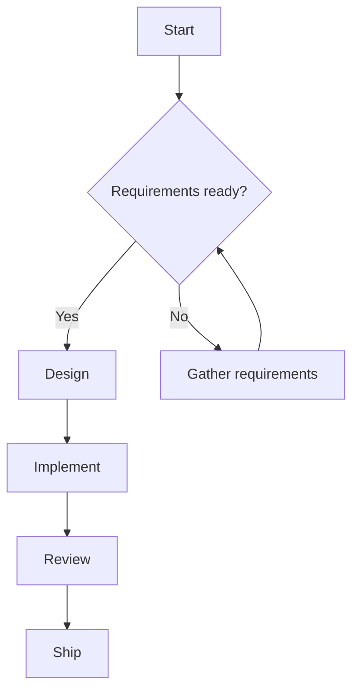

# Project Status Report / تقرير حالة المشروع

This document demonstrates every feature **md2doc** supports: tables, Mermaid
diagrams, code blocks, and full Arabic / RTL text alongside English.

## 1. Overview / نظرة عامة

This is a regular English paragraph to show left-to-right rendering.

هذه فقرة باللغة العربية بالكامل لإظهار محاذاة النص من اليمين إلى اليسار
وتشكيل الحروف بشكل صحيح في كل من HTML و Word.

Mixed-direction example: the project codename is **مشروع الفينيق** (Project
Phoenix), led by Sarah Chen and محمد العتيبي.

## 2. Standard Table

| Task | Owner | Status |
|---|---|---|
| API design | Sarah | Done |
| Backend | Omar | In progress |
| QA | Lina | Pending |

## 3. Complex Table (alignment + RTL content)

| المهمة (Task) | المسؤول (Owner) | :الحالة (Status) |
|:--|:-:|--:|
| تصميم الواجهة | فريق التصميم | مكتمل |
| Backend integration | محمد | قيد التنفيذ |
| اختبار الأداء | Lina Park | معلق |

## 4. Process Diagram (Mermaid)



## 5. Nested Lists

- Frontend
  - Login page
  - Dashboard
- Backend
  - Auth service
  - Billing service
    1. Stripe integration
    2. Invoice generation
- واجهة عربية
  - دعم الكتابة من اليمين لليسار

## 6. Code Sample

```python
def greet(name: str) -> str:
    return f"Hello, {name}!"
```

## 7. Quote

> Good design is as little design as possible.
> — Dieter Rams

> التصميم الجيد هو أقل قدر ممكن من التصميم.

---

## 8. Links and Emphasis

Visit the [project tracker](https://example.com/tracker) for details. This
sentence has *italic*, **bold**, ~~strikethrough~~, and `inline code`.
